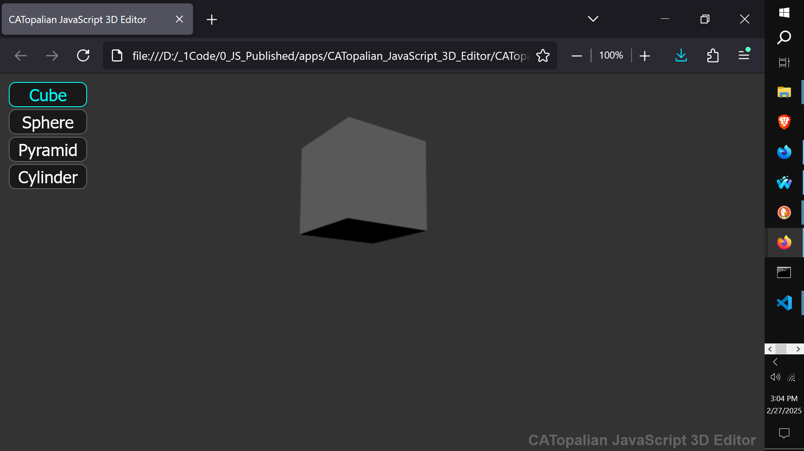
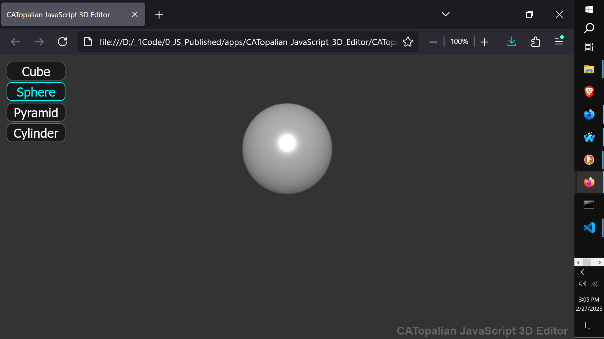
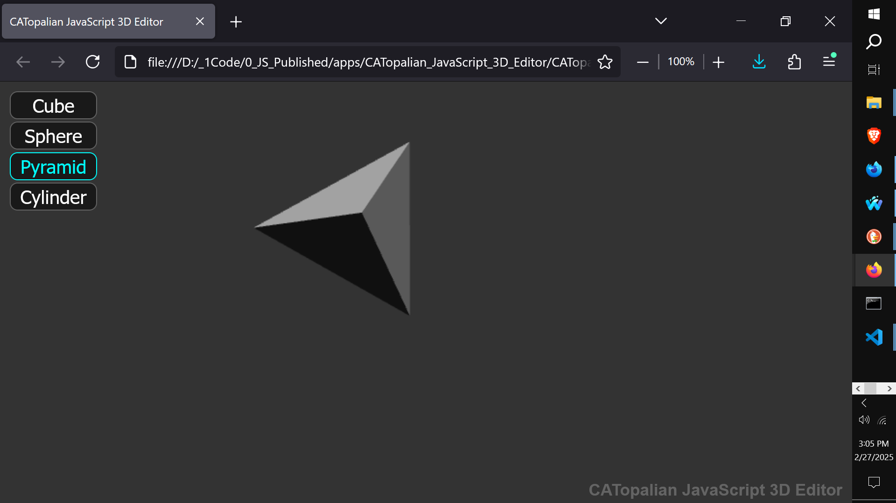
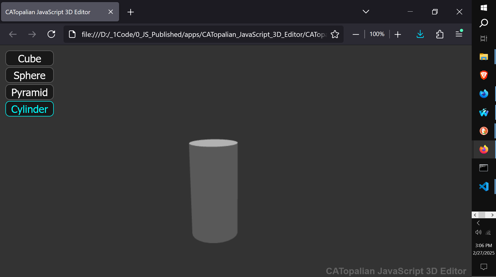
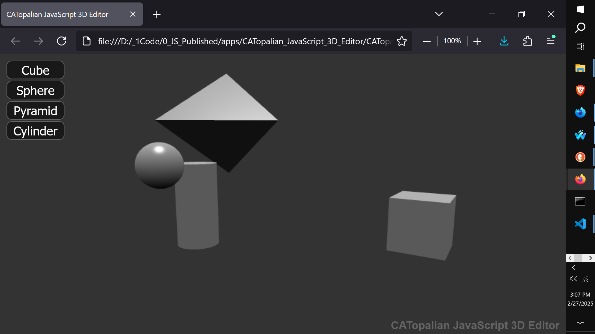

# CATopalian JavaScript 3D Editor
A JavaScript 3D Editor that uses Babylon.js to create 3D objects in a 3D environment.

VIDEO: https://www.youtube.com/watch?v=iqjjMmaAqMQ

https://github.com/ChristopherAndrewTopalian/CATopalian_JavaScript_3D_Editor

---

### How to Download this App
1. Click the green Code Button on this github page
2. Choose Download ZIP
3. Save the Zip File
4. Extract All
5. Double click the HTML file to start the App

